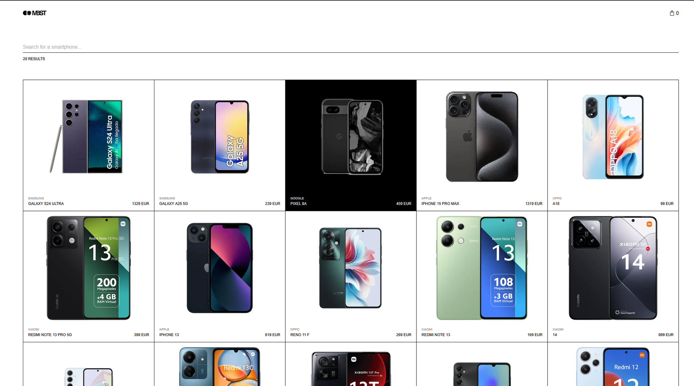
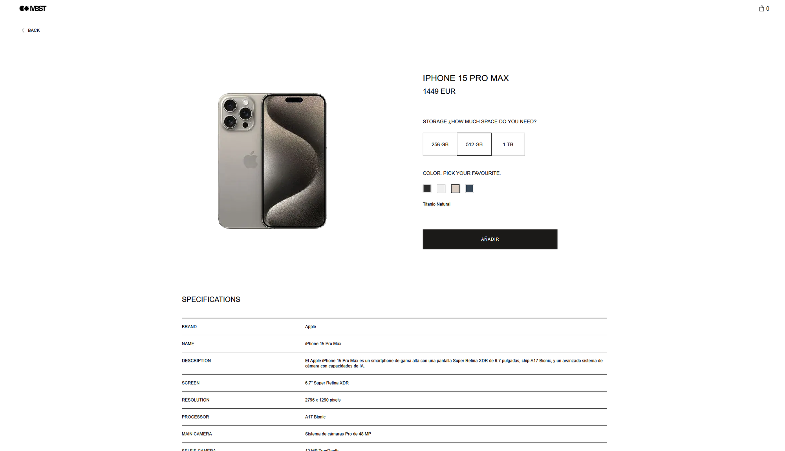
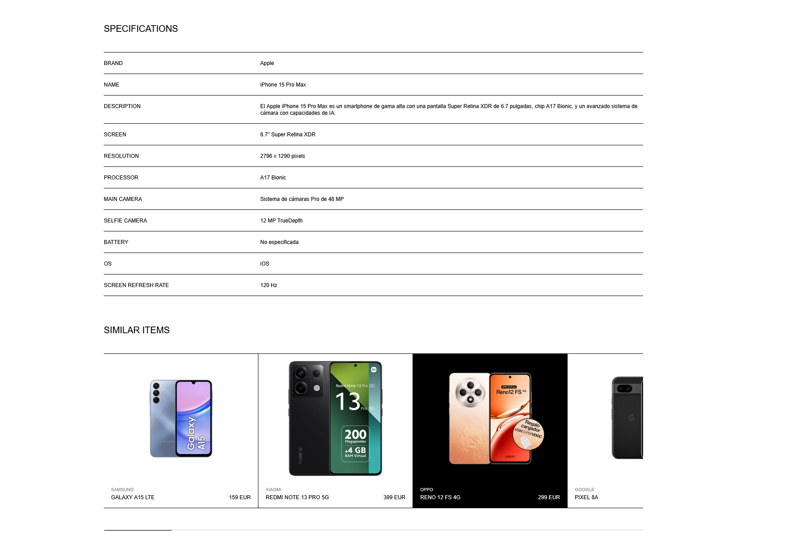
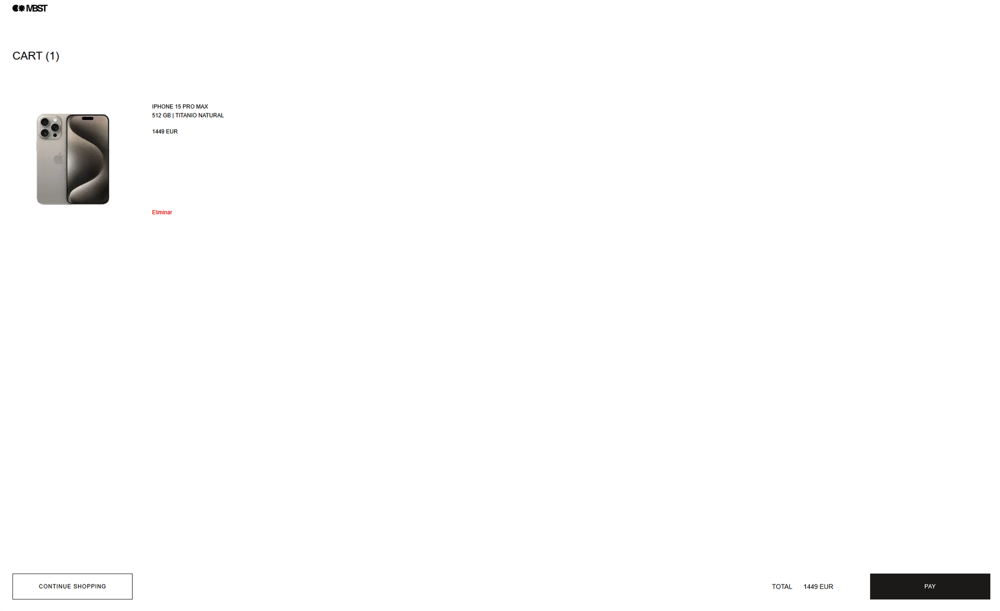

# Tienda de móviles

Aplicación web para consultar un catálogo de teléfonos móviles, buscar por marca o modelo, ver el detalle de cada producto y gestionar un carrito persistente.

**Demo:** [zara-challenge](https://zara-challenge-three.vercel.app/)

| Listado                                                            | Detalle                                                                                         |
| ------------------------------------------------------------------ | ----------------------------------------------------------------------------------------------- |
|  |  |

| Especificaciones y similares                                                          | Carrito                                                                          |
| ------------------------------------------------------------------------------------- | -------------------------------------------------------------------------------- |
|  |  |

## Alcance y simplicidad

El código prioriza la simplicidad sobre la flexibilidad especulativa: se implementa lo que pide el enunciado y el diseño de Figma, sin abstracciones genéricas para casos hipotéticos ni infraestructura que ningún requisito necesita todavía (más detalle en [Testing y calidad](#testing-y-calidad)). Es más fácil de auditar y razonar sobre él, y en una prueba de alcance cerrado y plazo corto eso importa más que preparar el terreno para requisitos que no existen.

Por el mismo motivo no se usa desarrollo dirigido por especificaciones (SDD): documentar cada requisito con un ID propio, decisiones en ADRs y trazabilidad explícita entre requisito, código y test. En un proyecto real, con varios equipos trabajando en paralelo durante meses y requisitos que cambian, esa trazabilidad es lo que permite saber por qué existe una decisión sin depender de la memoria de quien la tomó, y evita que dos personas interpreten el mismo requisito de formas distintas. Aquí el enunciado y el diseño ya cumplen ese papel de especificación única: documentarlos otra vez en un formato aparte duplicaría la misma información sin la trazabilidad que la justificaría.

Algunas decisiones de interacción —la animación de reordenado del listado, el debounce del buscador, la hidratación diferida del carrito— no salen de prueba y error en este ejercicio: ya estaban resueltas y probadas de antes, así que se mantienen tal cual en vez de reabrir ese diseño.

## Cómo ejecutar

Requisitos: Node.js ≥ 18.18 y npm.

```bash
npm install
cp .env.example .env.local   # y rellenar API_KEY
npm run dev                  # http://localhost:3000
```

La clave de la API (`x-api-key`) solo se usa en el servidor y nunca llega al navegador.

| Comando                      | Qué hace                                     |
| ---------------------------- | -------------------------------------------- |
| `npm run dev`                | Desarrollo (assets sin minimizar)            |
| `npm run build && npm start` | Build y servidor de producción (minimizados) |
| `npm test`                   | Tests unitarios y de componentes             |
| `npm run typecheck`          | Comprobación de tipos                        |
| `npm run lint`               | ESLint                                       |
| `npm run format:check`       | Prettier                                     |

## Estructura del proyecto

```
src/
  app/            # Rutas (Next.js App Router): listado, detalle, carrito, loading/error/not-found
  components/
    layout/       # Navbar (con su logo e icono de bolsa) y la barra de carga
    product/      # Tarjeta, grid, buscador, contador de resultados
    detail/       # Selectores de color/almacenamiento, precio e imagen animados, specs, similares
    cart/         # Línea de carrito y resumen
                  # Cada componente vive en su propia carpeta junto a su test y su .module.scss
                  # (un icono usado por un único componente vive dentro de esa misma carpeta)
  context/        # CartContext (useReducer + persistencia en localStorage)
  hooks/          # useDebounce, useFlip, useExitAnimation, usePreviousValue... (cada uno en su carpeta, con su test)
  lib/            # api.ts (fetch server-only), products.ts (mapeo de la API), types.ts, utils.ts
  styles/         # tokens.scss (variables CSS), mixins de breakpoints, estilos globales
```

Cada carpeta de componente expone un `index.ts` que reexporta el componente, así el resto del código lo importa igual que a un fichero suelto (`@/components/detail/ColorSelector`).

## Decisiones técnicas

- **Next.js App Router con SSR.** El listado y el detalle se renderizan en el servidor: la clave de la API nunca sale de ahí y el despliegue es nativo en Vercel.
- **Clave de API solo en servidor.** `lib/api.ts` importa `server-only`: si algún Client Component llegara a importarlo, el build falla. La variable de entorno no lleva prefijo `NEXT_PUBLIC_`, así que en el navegador ni siquiera existiría.
- **Búsqueda en la URL, filtrada por la API.** `?search=` se envía tal cual a la API (no se filtra en el cliente), así que el resultado es compartible, funciona sin JavaScript y se renderiza en el servidor.
- **Cliente solo donde hace falta.** `ProductConfigurator` y `SimilarProducts` son client components porque mantienen estado o gestionan gestos, pero las partes que no dependen de eso (el nombre del producto, las tarjetas de productos similares) se renderizan en el servidor y llegan como `children`, igual que ya hace `ProductGrid` con `FlipList` en el listado.
- **Una sola transición para toda navegación de cliente.** Buscar y añadir al carrito comparten el mismo `useTransition` (`NavigationProgressContext`), así la barra de carga refleja cualquier navegación en curso en vez de solo una de ellas.
- **Carrito con Context + `useReducer`.** Es el único estado que de verdad se comparte entre pantallas (navbar, detalle, carrito). Se persiste en `localStorage`, pero la carga ocurre en un `useEffect` tras montar para no romper la hidratación (servidor y primer render de cliente no tienen acceso a `localStorage`).
- **SCSS Modules con variables CSS.** Funcionan en Server Components sin coste de runtime (a diferencia de librerías CSS-in-JS, que exigirían marcar más componentes como cliente). Los tokens de Figma (colores, tipografía, espaciados, duraciones) viven como custom properties en `styles/tokens.scss`.

## Testing y calidad

- Jest + Testing Library para lógica y componentes; `jest-axe` en los componentes principales para accesibilidad automatizada.
- ESLint (config de Next + `jsx-a11y`) y Prettier.
- Consola del navegador limpia en desarrollo y producción.
- Alcance de herramientas ajustado al tamaño del proyecto: sin hooks de Git, linter de commits, linter de estilos aparte ni pruebas end-to-end. El flujo de verificación manual (typecheck, lint, tests y build antes de cada commit) ya cubre lo que esas herramientas automatizarían, y los tests de componentes ya ejercitan las mismas interacciones de usuario que cubriría un end-to-end.

## Despliegue

Desplegado en Vercel. Variables de entorno necesarias en el proyecto: `API_KEY`. El proyecto exige Node ≥ 18.18, pero en Vercel se ejecuta con Node 24 por compatibilidad con su entorno de build.

## Mejoras futuras

- Checkout real tras "PAY": resumen, formulario de pago y vaciado del carrito.
- Selector de cantidad en el carrito, agrupando líneas idénticas.
- Sincronizar el carrito entre pestañas con el evento `storage`: ahora mismo, si se añade un producto distinto en cada una de dos pestañas abiertas a la vez, la que guarda en segundo lugar sobrescribe a la primera y uno de los dos productos no se llega a guardar.
- Tests end-to-end (Playwright) sobre el flujo completo de compra.
- Integración continua (GitHub Actions) con typecheck, lint, test y build en cada push.
